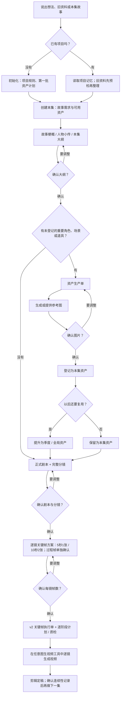

# 短剧管家：从想法到分镜的项目记忆（适用于codex或者有图片生成能力的agent）

`$short-drama-butler` 管的是“这个项目已经有什么、这集还缺什么、哪些设定不能变”。你只需要用自然语言说故事和人物名称；它会自动读取项目配置、历史设定和素材索引。它不会要求你记 `C01`、文件路径或 Markdown 文件名。

它可配合 `$seedance-storyboard-generator` 写大纲、剧本和分镜，也可配合任何图片或视频工具。

## 先选一种使用方式

| 你的情况 | 你只需这样说 | 短剧管家会做什么 |
| --- | --- | --- |
| 从零开始做一个新系列 | “我要做一个关于会说话的打印机的都市轻喜剧。” | 先问必要的项目参数，再建立故事方向、资产计划和项目资料夹。 |
| 已有项目、旧文档或图片 | “这些是我以前的角色图、场景图和设定 Word，帮我整理成项目。” | 先预检和分类，等你确认后迁移素材、记录冲突、建立资产库。 |
| 今天只做一集独立短剧 | “做一集《雨夜来信》：许岚在旧书店收到一段录音。” | 自动读取当前项目，建立本集需求、素材清单和分镜交接包。 |
| 这一集需要不同的时长或画幅 | “做一集特别篇，这集 180 秒。” | 只覆盖这一集的参数，不改变项目其他集的默认设置。 |
| 继续做连续剧的下一集 | “继续第 2 集：承接上一集结尾，许岚决定去找管理员。” | 读取已锁定设定和上一集状态，再创建下一集。 |
| 大纲里出现新角色或新场景 | “大纲确认了，请为神秘访客和旧书店制作本集资产生产单。” | 给出图片生产任务和出图提示词；图片确认后才登记为可用资产。 |

不需要在提示词里写“读取项目配置”“创建素材清单”这类工作指令。这些是 Skill 的默认动作。

## 一眼看懂整个流程

你只需要说故事、提供已有资料，并在关键节点回复“确认”或指出要改的地方。短剧管家自动读取项目记忆、整理文件和交接分镜，不需要你记编号、路径或关键帧的内部版本号。



### 你只做 5 件事

1. 说清楚这集想讲什么，或把旧资料放进项目目录。
2. 确认大纲；若有新角色、重要场景或关键道具，再确认它们的参考图。
3. 确认正式剧本和分镜是否符合预期。
4. 确认关键帧方案；只有被单独提出且你明确同意的过程帧才会使用第 3 张图。
5. 按 `keyframe-execution.md` 的当前确认版和 v2 执行单的已批准阶段逐镜出图、质检、生成视频并剪辑；本集完成后确认连续性记录。

### 你不必管的事

- 不必输入 `C01`、`S02` 等内部编号，也不必说“读取配置”或“创建交接包”。
- 不必手动维护素材索引、剧集状态和交接文件；短剧管家会自动更新它们。
- v2 不创建 `keyframes/pending/`。新图先以递增版本归档到 `keyframes/work/`，最后阶段质检通过才进入 `keyframes/final/`；旧 `pending/` 文件不会被移动、覆盖或自动迁移。
- 新资产默认只属于本集；只有你明确说“以后还会用”或“升为全局素材”，它才会进入可跨集调用的资产库。

### 默认分镜节奏

`storyboard.md` 默认是导演版逐镜说明，不是表格。Skill 会按剧情、动作、对白和情绪变化智能拆镜：优先使用 5 秒和 10 秒；目标总时长最后无法整除 5 秒时，才使用不足 5 秒的余数。

- 5 秒或余数：一张首帧图。
- 10 秒：首帧 + 尾帧两张图。
- 过程帧：只在变形、魔法、复杂走位或关键反转确实需要中间状态时提出；会写明理由，必须由你逐镜明确确认。没有确认就按两张执行。

每个导演版镜头都会列出关键画面 / 首尾帧、运镜、精确台词口型时间段、非说话嘴型控制、声音、转场、素材参考和出图提示词。因此既能用于任何图生视频工具，也能让后续剪辑保持连贯。

正式分镜生成后，短剧管家会先做结构校验：表格、6 / 7 秒镜头、遗漏“首帧 A / 尾帧 B”或口型控制等字段，都会被打回修正，不会直接交给你确认。

## 最常用：做一集短剧

直接说故事、已有人物和已知场景即可：

```text
$short-drama-butler

做一集《雨夜来信》：许岚在旧书店收到一段录音，
管理员提醒她不要独自追查。这集目标时长 180 秒。
```

它会自动：

1. 找到当前项目并读取画幅、时长、内容限制、角色圣经和现有素材。
2. 用“许岚”“管理员”“旧书店”这些名称匹配资产；不认识的名称先列为本集新增资产。
3. 创建本集资料和 `storyboard-package.md`。
4. 交给分镜 Skill 先产出梗概、人物小传和本集大纲，等你确认。

“这集 180 秒”“这集用 9:16”这类要求只写入本集的 `episode-overrides.yaml`，不会把其他剧集的默认参数改掉。

若换了一个项目或目录，只需先说“初始化一个新项目”或“这里是我以前的项目资料”。

## 大纲确认后：什么时候做新角色和背景图？

重要的新角色、会反复出现的场景、关键道具，应在**大纲确认后、正式剧本和分镜前**制作参考图。此时故事需求已经清楚，又还来得及保证后续镜头一致。

```text
确认大纲
   ↓
短剧管家生成 asset-production-plan.md
   ↓
你确认资产生产单
   ↓
用图片工具生成 / 提供参考图
   ↓
你确认图片 → 短剧管家归档并按名称登记
   ↓
正式剧本和分镜
        ↓
你确认剧本与分镜符合要求
        ↓
逐镜关键帧方案（5 秒 1 张、10 秒 2 张；过程帧逐镜确认）
        ↓
生成关键帧 → 图生视频 → 剪辑
        ↓
本集定稿 → 确认连续性记录 → 下一集自动承接
```

只出现一次的普通背景、小道具，可以等剧本完成后、为对应关键帧出图前再做。没有确认的图片不能当成锁定素材。

角色与重要场景需要的不是一张“好看图”，而是一套供后续镜头保持一致的参考图：角色默认制作**正面、侧面、背面**三张；重要场景默认制作**正打、反打、侧面全景**三张。它们归为同一项素材，你以后仍只需说“神秘访客”或“旧书店”，不需要记住任何编号或视图文件名。

## 剧本与分镜确认后：再规划关键帧

短剧管家不会在正式剧本和分镜刚写完时自动开始出图。它会先让你确认两件事：故事、台词、节奏是否符合预期；每个镜头的画面与时长是否需要调整。你只需回复“确认剧本和分镜，继续规划关键帧”，或者直接说要改的镜号和内容。

确认后，短剧管家会生成 `keyframe-plan.md`，为每镜建议并让你确认关键帧数量：

| 镜头情况 | 建议关键帧 | 适用情形 |
| --- | --- | --- |
| 静态构图、轻表情、很短动作 | 1 张首帧 | 例如角色抬头、物品微光。 |
| 有明确位移或情绪变化 | 首帧 + 尾帧 | 例如角色走到另一处、镜头推近后的表情变化。 |
| 分阶段动作、变形或重点情节 | 首帧 + 过程帧 + 尾帧 | 例如挖出水道、变身、追踪或重要救援。 |

多帧能让支持多参考帧的图生视频工具更好理解过程，但并非越多越好：每一张都必须是动作中的一个清晰阶段，不能只是近似重复图。你确认关键帧方案后，短剧管家会建立 v2 执行单并逐帧准备已批准的输入计划；图片工具由你选择，短剧管家不绑定或自动调用任何图片、视频或剪辑供应商。调用方只能使用计划中的输入，记录结果后再进入质检。

关键帧执行单不是一句“让角色动起来”的提示。它会逐镜继承 Storyboard Generator 的时长、景别、运镜、起点、过程、终点、台词、声音策略、音效、入点、出点 / 转场、素材参考和原分镜出图提示词。它的 Markdown 只显示当前确认版；配套的 `keyframe-execution-manifest.json` v2 记录每阶段实际输入、哈希、质检和完整版本链。因此同一集的故事、分镜、关键帧和图生视频不会各自变成另一套版本。

## 五种创作模式，怎么走

### 从零开始做一个新系列

```text
$short-drama-butler

我要做一个新系列：共享办公室里有一台会说话的打印机。
```

先完成项目参数、故事方向、人物关系和“第一批应先做的角色/场景/道具”。确认这些核心资产的图片后，再开始第一集。这样每集都能保持同一角色长相和场景风格。

### 已有项目、旧文档或图片

把 Word、旧剧本、角色图、场景图放在项目目录，然后说：

```text
$short-drama-butler

这是我已有的项目资料，帮我整理后再开始做新一集。
```

它会先给你预检清单：哪些是角色、场景、道具，哪些适合全局复用，哪些文字与图片冲突。你确认后才迁移和重命名；已确认图片优先于旧文字描述。

### 今天只做一集独立短剧

即使每集故事没有关系，也可共用同一个项目的风格和常用素材：

```text
$short-drama-butler

做一集《雨夜来信》：一位陌生访客把录音交给许岚。
```

如果“陌生访客”以后不用，它只留在本集；下次要新人物时，再按同一流程生产即可。

### 继续做连续剧的下一集

```text
$short-drama-butler

继续第 2 集：承接上一集最后的录音，许岚决定去找管理员。
```

短剧管家会以已锁定角色、场景、资产和本集状态为准。只有要新增视觉素材时，才进入资产生产单关口。

如果上一集还没有确认连续性记录，它会先停在确认节点，不会猜着继续写；只有你明确说“这是一集独立故事”时，才不会承接上集。

本集定稿后，再说：

```text
$short-drama-butler

这一集定稿了，请整理并让我确认本集连续性记录。
```

它会把“发生了什么、人物目前怎样、最后一帧是什么、下集要承接什么”写入 `episode-continuity.md`。只有你确认过的记录才会被下一集自动继承，因此不会把聊天中的临时想法误当正式剧情。

### 大纲里出现新角色或新场景

```text
$short-drama-butler

大纲确认了。为“神秘访客”和“旧书店”制作本集资产生产单。
```

生产单会写清楚每项是什么、为什么需要、默认属于哪一集、应该生成什么样的参考图和出图提示词。图片放进项目目录并确认后，你只需说“确认神秘访客这张图，登记为本集角色”；它会归档到标准素材库、记录迁移账本、更新本集交接包。想复用时再说“把旧书店升为全局场景”。

角色一次提供正面、侧面、背面三张时，可以直接说“这三张分别是神秘访客的正面、侧面、背面，确认登记为本集角色”。场景同理可提供正打、反打、侧面三张；短剧管家会把同一组图绑定到一个名称下。

## 每个文件是做什么的

你平时无需手动编辑这些文件；它们是短剧管家和分镜 Skill 的共同记忆。完整说明见 [项目文件参考](.agents/skills/short-drama-butler/references/project-files.md)。

```text
project-settings/                 项目级、不随单集变化的记忆
source-material/                  原始 Word、旧设定稿（保留来源）
assets/                           已确认图片素材库
episodes/EP001_剧集名/            只属于这一集的工作资料
```

| 文件 | 什么时候看它 | 它的作用 |
| --- | --- | --- |
| `project-settings/project.yaml` | 更改画幅、时长、内容尺度或制作工具时 | 项目默认参数；创建每一集时会自动读取。 |
| `character-bible.md` | 人物设定出现矛盾时 | 记录不可改变特征、可补充特征和角色状态。 |
| `asset-index.json` | 想核对已有素材时 | 名称、别名、图片路径和内部编号的总索引；你只需使用名称。 |
| `setting-conflicts.md` | 文字和已确认图片不一致时 | 记录裁决；确认图片是视觉准则。 |
| `episodes/<集>/story-brief.md` | 大纲前 | 这一集想讲什么、要谁出场、有什么限制。 |
| `episodes/<集>/episode-overrides.yaml` | 本集有特殊时长、画幅或内容限制时 | 只覆盖这一集；项目默认值保持不变。 |
| `episodes/<集>/episode-continuity.md` | 本集定稿后、下一集开始前 | 已确认的剧情事实；下一集自动读取。 |
| `episodes/<集>/episode-assets.md` | 检查这一集能用什么 | 已有素材和本集新增草案；新增草案还没有图片。 |
| `episodes/<集>/asset-production-plan.md` | 大纲确认后 | 新角色/场景/道具的出图任务与提示词。 |
| `episodes/<集>/asset-production-manifest.json` | Agent 或工具登记图片时 | 生产单的机器可读状态、图片路径和确认状态。 |
| `episodes/<集>/creative-review.md` | 确认正式剧本和分镜后 | 记录用户已确认当前剧本与分镜，是关键帧规划的第一道关口。 |
| `episodes/<集>/keyframe-plan.md` | 剧本和分镜确认后 | 逐镜列出时长、动作、建议关键帧数量和首/过程/尾帧。你确认后才出图。 |
| `episodes/<集>/keyframe-manifest.json` | Agent 或工具执行出图时 | 关键帧方案的机器可读状态；防止未确认就生成图片。 |
| `episodes/<集>/keyframe-execution.md` | 关键帧方案确认后 | v2 执行单的人类可读镜像：保留分镜信息，展示每帧当前确认文件。 |
| `episodes/<集>/keyframe-execution-manifest.json` | Agent 或工具执行时 | schema v2 的状态源：结构化素材用途、已批准阶段输入、实际输入、QA 和全部版本历史。 |
| `episodes/<集>/keyframes/work/` | 任一阶段产图并记录后 | 按 `KF<镜号>-<帧类型>/rNNN-<阶段>` 保存的不可覆盖工作版本。 |
| `episodes/<集>/keyframes/final/` | 最后阶段质检通过后 | 按 `KF<镜号>-<帧类型>/rNNN` 保存的确认版本；可作为连续性锚点。 |
| `references/user/` | 你指定某张额外关键帧参考图的用途和范围后 | 已登记用户覆盖图及哈希；不改写素材索引。 |
| `episodes/<集>/storyboard-package.md` | 交给分镜 Skill 前 | 本集唯一的交接包：参数、锁定资产、剧情需求和制作约束。 |

## 交给 Storyboard Generator

同一段对话中，短剧管家创建交接包后，直接说：

```text
$seedance-storyboard-generator

继续处理刚才短剧管家创建的这一集。
```

新对话中才需要告诉它交接包路径。它会先给大纲；确认大纲并处理完必要的新资产后，再写正式剧本和镜头表。

短剧管家首次使用时会自动检测同级 `seedance-storyboard-generator`；缺失时只下载固定版本、校验过的 Skill 子目录，不覆盖已有安装。详情见[交接优先协议](.agents/skills/short-drama-butler/references/seedance-integration-protocol.md)。

## 常见问题

**我必须记住 C01、S02 吗？** 不必。它们是内部编号；你一直用“许岚”“旧书店”“录音笔”即可。

**我能直接给一张图片吗？** 可以。说明它约束人物身份、道具身份、背景、光线、构图还是风格，以及适用于单镜、连续段还是整集。人物或道具身份还要说明对应谁；系统会把项目内原图登记到 `references/user/`，记录哈希和范围，不会把它误当作全局素材。

**新人物什么时候变成全局人物？** 只有你明确确认会在后续剧集复用时。否则它默认仅属于当前集。

**会自动生成视频吗？** 不会。它管理故事和素材交接；图片、图生视频和剪辑由你选择的工具完成。

**换电脑后能保留项目记忆吗？** 公开仓库不会上传你的图片、剧本或连续性记录。需要跨设备或灾备时，请自行把整个项目目录做本地备份、加密归档或保存到你控制的私有存储。
